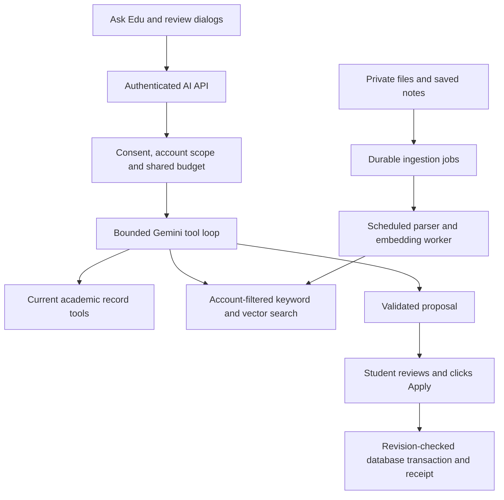

# Academic AI: implementation and rollout plan

Updated September 18, 2026. This is an adults-only, synthetic-data pilot. Public release remains gated on live evaluation and deployment checks.

## Recommendation

Start with the implemented Gemini provider and `gemini-3.8-flash` as the quality baseline. Compare `gemini-3.5-flash-lite` on the same held-out academic cases before choosing the production default. Use the cheapest model that passes the release gates; model price alone is not evidence of reliability. Keep the model configurable and record its identity with every answer. Do not automatically switch models during an outage until the fallback has also passed evaluation.

Use the **paid Gemini API for real student data**, with an appropriate privacy notice and provider settings. Google's pricing page distinguishes free-tier product-improvement use from paid-tier handling. The free pilot must contain fictional records and documents only. No model guarantees zero hallucinations. Citations prove where evidence came from; they do not prove that every sentence correctly interprets it. [Google pricing and data-use table](https://ai.google.dev/gemini-api/docs/pricing), [Gemini models](https://ai.google.dev/gemini-api/docs/models), [API terms](https://ai.google.dev/gemini-api/terms).

## What an average student uses it for

Planning assumption, to validate with pilot analytics:

| Share | Example | Required source or execution |
| --- | --- | --- |
| 40% | What is due this week? What is tomorrow's schedule? | Current assignments and calendar tools |
| 25% | Which assignment should I start first? Am I behind? | Deadlines, saved progress and recorded study; label estimates |
| 20% | What is the late policy? What chapters are on the exam? | Retrieved syllabus/notes passages with source citations |
| 10% | Move this study block; mark my lab done | Read target, prepare changes, review, atomic Apply receipt |
| 5% | Explain a concept from my notes | Course-aware general explanation; distinguish it from saved facts |

Assume roughly 5 questions on each of 20–30 active days: **100–150 questions per active student per month**. Exam periods and long tutoring sessions can be much higher. Registered users who never open the assistant do not incur chat inference costs.

## Cost model

Prices checked September 18, 2026, USD per million tokens. Output includes thinking. [Official Gemini pricing](https://ai.google.dev/gemini-api/docs/pricing).

| Model | Input | Output | Intended role |
| --- | ---: | ---: | --- |
| Gemini 3.8 Flash through December 2026 | $0.75 | $3.75 | Quality baseline |
| Gemini 3.8 Flash from January 2027 | $1.50 | $7.50 | Conservative budget configuration |
| Gemini 3.5 Flash-Lite | $0.30 | $2.50 | Lower-cost candidate; requires evaluation |
| Gemini Embedding 2, text | $0.20 | — | Index and query vectors |

Assume **12,000 aggregate input tokens and 1,500 aggregate output/thinking tokens per question**, summed across all tool-loop calls. This includes repeated tool definitions, context and history. It is a planning estimate, not measured production usage. Formula:

`monthly chat cost = questions × (input tokens × input price + output tokens × output price) / 1,000,000`

| Questions/month | Flash current | Flash 2027 | Flash-Lite |
| --- | ---: | ---: | ---: |
| 40, light | $0.59 | $1.17 | $0.29 |
| 150, typical active | $2.19 | $4.39 | $1.10 |
| 600, heavy | $8.78 | $17.55 | $4.41 |

Add roughly 25% planning headroom for retries and longer answers, then document indexing, database/storage and hosting. At 150 questions each, 1,000 active users imply approximately **$2,742/month for current Flash or $1,378/month for Flash-Lite**, including that headroom but excluding infrastructure. The current pilot's 100 provider calls/day is intentionally far below production capacity.

A 100,000-token document collection costs about $0.02 to embed once; re-indexing and overlap add to this. Store each source version once rather than embedding all files for every question. The existing Supabase and Worker infrastructure is reused. Set an initial infrastructure allowance of $30–100/month for a small paid pilot as a planning reserve, not a vendor quote; validate against actual plan, storage, egress, invocation and CPU usage before launch. Voice, OCR and internet search are excluded from these estimates.

Reduce costs by retrieving a few relevant passages, limiting history, providing deterministic dashboard summaries without a model, bounding responses/tool loops, indexing only changed sources, and introducing a tested cheaper model. Do not send the entire semester's files in every prompt.

## Architecture and additions



| Layer | Implementation |
| --- | --- |
| User interface | `/assistant`, conversation history, source excerpts, source exclusion, consent, before/after preview, receipts and exports |
| API | `/api/ai/[resource]`; existing verified Google session, same-origin writes and profile scope checks |
| Context | Consistent workspace snapshot; timezone, term, study goal and academic preferences; no names/emails included in the profile prompt |
| Tools | Courses, assignments, calendar/classes, today's schedule, recorded study, grades and deterministic credit-weighted calculation |
| Retrieval | Fresh inline notes/syllabi plus account-filtered hybrid PostgreSQL full-text and 768-dimensional pgvector search |
| Actions | Create/update/complete assignments; create/move manual calendar events; maximum ten operations in one proposal |
| Model adapter | Server-only Gemini REST; preserved thought signatures; structured tool results; validated answer blocks and citation IDs |
| Persistence | Eight restricted AI tables, source versions, conversation/message IDs, proposal receipts, budgets and usage metrics |
| Background processing | Separate scheduled Cloudflare Worker, database leases, retries, extraction bounds, embedding batches and retention cleanup |

“Full academic context” means permissioned access to all supported saved records and sources as needed. It does not mean unlimited prompt context, awareness of unsaved edits, or access to unsupported LMS/email/calendar services.

### Answer and action integrity

- Facts, suggestions, general explanations and missing information have distinct presentation. Missing scores, durations or policies remain unknown.
- Student-specific factual blocks require known citation IDs. Record citations retain the workspace revision; document citations identify source version and page. Changed/excluded/deleted source checks block unavailable excerpts.
- Grade arithmetic executes in TypeScript. Saved course grades cannot support invented assessment weights or predictions about passing a final.
- A tool can only prepare a proposal. The server validates the complete resulting academic snapshot, targets and date/time constraints.
- Apply is a separate authenticated operation. It checks profile and workspace revisions, commits all changes atomically and returns a durable receipt. Repeated Apply returns the existing receipt. Stale previews cannot overwrite intervening edits.
- The UI flushes pending edits before asking or applying. Failed saves preserve the question. Success text comes from the saved receipt.
- The runner is capped at four model turns, six total HTTP attempts (including retries), and twelve tool calls. Temporary transport/service failures use at most two retries per turn with exponential backoff and jitter; every attempt reserves quota. Authentication, malformed requests and quota errors are not automatically retried. Request bytes, answer length, file sizes and pages are bounded. No model-directed SQL, arbitrary code, network requests or notifications are exposed.
- Documents and conversation history are untrusted input. Prompt-injection resistance needs live adversarial evaluation; instructions alone are not a security boundary. Account filtering, function allowlists, validation and separate Apply enforce the boundary.

## File support

TXT, Markdown and selectable-text PDFs: maximum 10 MB, 100 PDF pages, one million extracted PDF characters and 500 chunks. Every PDF page must contain extractable text; blank or image-only pages conservatively fail the document. OCR, image analysis, DOCX and slide decks are deferred.

Files remain in the existing private Supabase bucket. Parsing happens in the ingestion worker; only extracted passages/embedding inputs reach Google after pilot eligibility and consent. Jobs use account ownership, file hashes, leases and source versions. Failed embeddings leave keyword search usable. Source exclusion is enforced for both indexed passages and fresh inline notes. Old answers remain until conversations are deleted or expire.

The pilot uses exact vector search after account filtering. Before scaling to large document collections, measure query latency and database size, then introduce partitioning or a filtered ANN design with recall tests. Do not add a separate vector vendor for this pilot.

## Setup and operations

1. Apply the existing four persistence migrations, then these AI migrations in order:
   - `20260918000000_academic_ai.sql`
   - `20260918010000_ai_vectors.sql`
   - `20260918020000_ai_export_backfill.sql`
2. Configure server secrets in both the web runtime and ingestion runtime: `SUPABASE_URL`, `SUPABASE_SECRET_KEY`, `GEMINI_API_KEY`; the web app also needs its existing publishable auth key. Never use a browser-public environment variable for Gemini or the Supabase secret.
3. Copy the AI settings from `.env.example`. Start with `AI_ENABLED=false`, `AI_DATA_MODE=synthetic` and an empty allowlist. Set `AI_ALLOWED_PROFILE_IDS` only to dedicated fictional-data accounts; then enable the pilot. Each adult tester must complete the UI attestations themselves.
4. Deploy the web app through its existing Sites hosting workflow. Deploy `worker/ai-ingestion.wrangler.jsonc` to the intended Cloudflare account, with matching secrets and allowlist, and verify its scheduled trigger. A successful dry run is not a deployed worker.
5. Configure provider call/minute, token/minute and daily limits at or below the project's actual AI Studio quotas. The example values are application limits, not a promise of free quota. Embedding calls share the application's conservative budget.
6. Upload a fictional syllabus; confirm queued → processing → ready, find a quoted passage and open its citation. Test exclusion, deletion and source replacement. Confirm the scheduled worker runs cleanup even when AI generation is disabled.
7. Verify complete account export includes assistant data, and deleting a conversation removes its messages/proposals. Account deletion cascades owned AI rows; original-file deletion follows the existing private-file flow.

The shared database budget reserves a conservative upper bound **before** each provider call. Reservations are not refunded, so the application may stop earlier than the actual invoice limit. `ai_metrics` records model, token counts and latency without raw prompts. Compare metrics with provider billing before raising limits. The configured $25 monthly cap is a pilot limit, not a per-user subscription allowance. Provider budgets and alerts should also be configured for costs incurred outside this application.

Conversations expire 30 days from creation; metrics/budget rows expire after 90 days. Scheduled cleanup is necessary to enforce this policy. Monitor failed cron runs, oldest queued source, retries, provider errors, latency and usage. Turning generation off does not stop retention cleanup. An inactive/deleted worker cannot enforce retention.

### Useful commands

```sh
npm run ai:test
npm run ai:verify
npm run ai:eval
npm run ai:eval -- --live --limit 4 --smoke
npm run ai:eval -- --live --limit 4 --smoke --model gemini-3.5-flash-lite
npm run ai:eval -- --live --limit 120 --repeat 3
npm run ai:worker:check
node --env-file=.env scripts/verify-database.mjs
npm run lint
npx tsc --noEmit
npm test
```

The live evaluator sends only fictional fixtures, paces requests, stops on capacity/quota errors and writes ignored `.ai-evals/` reports. It does not mutate real accounts. Do not run the complete evaluation repeatedly against free quota without checking available limits. Reports always require human grading and never automatically approve release.

## Test and release plan

1. **Deterministic tests:** record ownership, auth/CSRF gates, date/time validation, grade arithmetic, citation validation, bounded tool loops, PDF extraction, quota behavior and stale/replayed requests.
2. **Database tests:** real PostgreSQL-compatible execution with pgvector; cross-account reads/actions, source leases/versions/exclusion, atomic Apply, source search and exported ownership. Separately verify live Supabase schema and anonymous denial.
3. **UI tests:** consent requirements, failed autosave, preserved question, review without writes, Apply failure without false success, and confirmed receipt display.
4. **Live model evaluation:** 120 synthetic cases, including 30 held-out variants; facts, document retrieval, missing data, actions, planning and adversarial prompts. Run three repeats per case for each candidate model. Expand beyond templated variants using observed pilot failure patterns.
5. **Human grading:** compare each factual claim to ground truth, check source support and conflicts, grade abstention, and inspect every action's target/date/time. Matching a string or citation ID does not establish factual correctness.
6. **Full staging flow:** two real authenticated test accounts containing only fictional content; ask/search/preview/apply/reload, parallel tabs and duplicate submits; test source indexing and authorization end to end on the deployed Worker/Postgres stack.

Proposed release gates: zero cross-account disclosure or unauthorized mutation in the test suite; zero incorrect critical dates/grades/action targets in held-out repeats; at least 98% supported factual claims; at least 95% correct abstention on missing-information cases; at least 95% retrieval recall for known-answer document cases. Measure p50/p95 latency and dollars per completed question; agree on acceptable limits from the pilot rather than promising an unmeasured SLA. These are acceptance targets, not guarantees about future answers.

## Roadmap after the pilot

1. Paid, consented beta: reviewed evaluations, production quotas, operational alerts, privacy/deletion checks and a tested fallback model.
2. Syllabus intelligence: structured extraction into a draft semester, conflicting-date detection, human review and deduplication before import. Extracted text search alone is not automatic semester construction.
3. Study planning: explicit workload estimates and availability; deterministic conflict detection plus a scheduling solver; preview all proposed blocks.
4. Tutor: subject-specific correctness evaluations, level calibration and practice questions grounded in course materials.
5. Proactive warnings: deterministic rules over saved deadlines/study goals, explicit opt-in and notification delivery with deduplication.
6. Supported external services and voice: scoped OAuth, connector permission controls, transcription/audio budgets and separate spoken confirmation for consequential actions.

## Installation and verification log

- September 18: all three AI migrations applied successfully to the connected EduEssentials Supabase project. Read-only verification found all eight AI tables, vector columns and RPCs; anonymous reads return 401. Account exports now include AI history and existing notes have source controls without changing workspace revisions.
- Gemini model listing authenticated successfully; `gemini-3.8-flash` simple synthetic generation returned HTTP 200 with the expected date.
- Live tool evaluation exposed an array-valued function-response format bug. The runner now wraps all tool results in an object and has a regression test. Provider errors now distinguish rejected requests from service-capacity failures.
- Subsequent Flash attempts returned confirmed HTTP 503 capacity errors. A passing simple smoke test is not a passing full evaluation.
- Final Flash smoke run passed automated deadline and syllabus checks after the protocol fix (7,179/1,225 and 5,738/449 input/output tokens respectively), then stopped on a confirmed capacity error in the missing-information case. The action case did not run. Report: `.ai-evals/2026-09-18T22-24-06.133Z.json` (local, ignored). The full release gate remains unmet.
- A four-case Flash-Lite comparison passed automated deadline and syllabus checks, but rejected a missing-information answer with malformed output and hit the action request limit. It is not yet a release-approved replacement. Report: `.ai-evals/2026-09-18T22-15-47.506Z.json` (local, ignored).
- Final local verification: 140 automated tests passed; TypeScript, ESLint, production build and ingestion Worker dry-run build passed. Live SQL verified eight AI tables, all with RLS enabled and SELECT denied to both anonymous and authenticated browser roles.
- The web changes and scheduled ingestion Worker have not been published by this task. The Worker configuration is packaged with AI disabled. No real student account has been enabled for free-tier processing.
- Full release evaluation, human grading, account-specific pilot activation and deployed scheduled-worker verification remain release requirements. Check the final task report for the latest test/deployment status.
